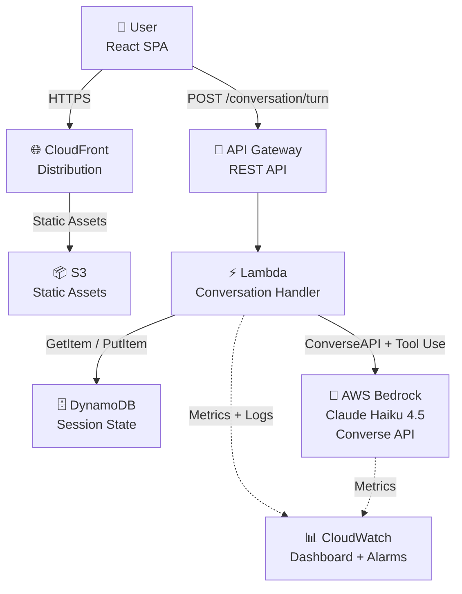
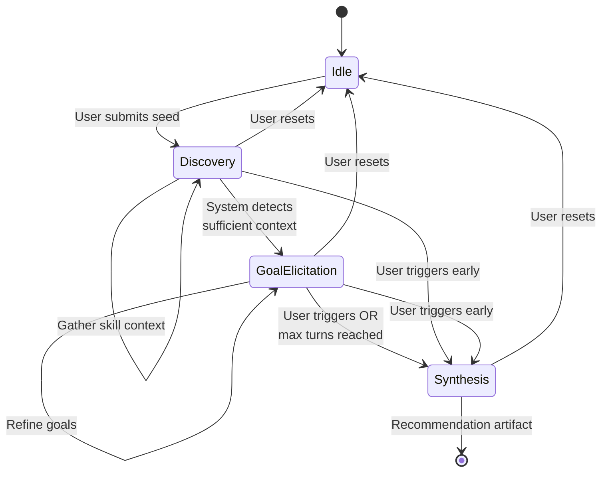

# career-compass

> A production-grade conversational AI platform that guides professionals through structured multi-turn dialogue to assess skills, surface career goals, and generate prioritized upskilling recommendations.

---

## Purpose

**career-compass** demonstrates mastery of conversational AI integration patterns in a serverless AWS environment. It showcases:

- **Multi-turn state management** via full message history accumulation across conversation phases
- **Phase-aware prompt architecture** with adaptive context switching (Discovery → Goal Elicitation → Synthesis)
- **Hybrid conversation control** combining system-guided questioning with adaptive handling of user-volunteered information
- **Structured output generation** via AWS Bedrock forced tool use and Zod schema validation
- **Cost-optimized inference** using Claude Haiku 4.5 on serverless compute

The application is built as a thematic companion to [resume-lens](https://github.com/mwarman/resume-lens) and [talent-finder](https://github.com/mwarman/talent-finder), forming a coherent portfolio suite of AWS Bedrock–powered career tooling.

---

## Architecture Overview

### High-Level Flow



### Conversation State Machine



---

## AI Integration Design

### Bedrock Converse API + Tool Use

**Conversational Turns:**

- Full message history passed to Bedrock Converse API on each turn
- Model-agnostic abstraction enabling flexible model swaps
- Natural language responses flow directly to frontend

**Synthesis Turn:**

- Backend forces tool use via `toolChoice: { tool: { name: "generate_recommendation" } }`
- Model returns structured `toolUse` block containing validated recommendation JSON
- Zod schema validates tool input on backend before payload reaches frontend
- Eliminates markdown wrapping and brittle prompt-only JSON enforcement

### Phase-Aware System Prompts

The backend maintains three distinct system prompts, swapped based on conversation phase:

| Phase                | Purpose             | Focus                                                |
| -------------------- | ------------------- | ---------------------------------------------------- |
| **Discovery**        | Establish baseline  | Probe current skills, experience, and domain context |
| **Goal Elicitation** | Surface aspirations | Clarify career direction, timeline, and constraints  |
| **Synthesis**        | Generate insight    | Force tool use to produce structured recommendation  |

Phase transitions are driven by:

- System self-evaluation after each turn
- User-triggered "I'm ready" signal
- Maximum turn enforcement (10 turns)

### Context Management (V1)

- Full message history accumulated per session
- Cost-controlled via Haiku model and 10-turn ceiling
- Progressive summarization documented as V2 enhancement

---

## Tech Stack

| Layer              | Technology                                                                  | Rationale                                                                   |
| ------------------ | --------------------------------------------------------------------------- | --------------------------------------------------------------------------- |
| **Frontend**       | Vite, React, TypeScript, TailwindCSS, shadcn/ui, TanStack Query, Axios, Zod | Modern, minimal-but-complete SPA stack; Zod for shared schema validation    |
| **Backend**        | AWS Lambda (Node.js / TypeScript), API Gateway (REST)                       | Serverless, pay-per-invocation, cost-optimized                              |
| **AI / Inference** | AWS Bedrock (Converse API + Tool Use), Claude Haiku 4.5                     | Model-agnostic abstraction; native multi-turn support; cost-optimized model |
| **Session State**  | DynamoDB (on-demand, TTL expiry)                                            | Serverless, low-cost, fits session lifetime pattern                         |
| **Infrastructure** | AWS CDK (TypeScript)                                                        | IaC; four-stack decomposition (Storage, API, Frontend, Observability)       |
| **CI/CD**          | GitHub Actions                                                              | CI, Deploy, and Teardown workflows                                          |
| **Observability**  | CloudWatch Dashboard + Alarms                                               | Service utilization and cost-bearing metrics                                |
| **Monorepo**       | npm workspaces                                                              | Shared Zod schemas across frontend and backend                              |

---

## Monorepo Structure

```
career-compass/
├── packages/
│   ├── api/              # Backend Lambda functions & API logic
│   ├── shared/           # Shared TypeScript types & Zod schemas
│   └── web/              # Frontend React SPA (Vite)
├── infra/                # AWS CDK IaC (four stacks)
├── docs/                 # Project documentation
├── package.json          # Root workspace config
└── tsconfig.base.json    # Root TypeScript config
```

Each package maintains its own `package.json`, `tsconfig.json`, and source tree.

---

## Local Development

### Prerequisites

- Node.js ≥ 24.15.0, npm ≥ 11.12.1
- AWS credentials configured locally
- Bedrock API access enabled in your AWS account

### Setup

```bash
# Install dependencies (all workspaces)
npm install

# Build all packages
npm run build --workspaces

# Run tests
npm test --workspaces
```

### Development Workflow

**Frontend (Vite dev server with HMR):**

```bash
cd packages/web
npm run dev
```

---

## Representative Conversation Example

This example demonstrates a complete Career Compass session flow: initial seed input through multi-turn discovery and goal elicitation, culminating in a structured recommendation.

### Seed Input (Turn 0)

**User:** "I'm a backend engineer with 8 years of experience building Node.js services. I've been mostly focused on backend infrastructure but want to transition into a technical leadership role."

### Turn 1: Discovery

**Assistant:** "Thank you for sharing that context. It's great that you have strong backend experience. To understand your skill foundation better: Beyond your Node.js expertise, what other backend technologies or frameworks have you worked with extensively? (e.g., databases, message queues, container orchestration, etc.)"

**User:** "I've worked with PostgreSQL, Redis, Docker, Kubernetes, and AWS. I've also led a couple of small projects, but mostly as an IC. I'm pretty comfortable with AWS Lambda and API Gateway."

### Turn 2: Goal Elicitation

**Assistant:** "Excellent — your cloud-native foundation is strong. Now let's understand your direction: When you envision a technical leadership role in 18 months, are you thinking team lead of backend engineers, engineering manager, tech lead (IC), or something else? And in which domain — backend infrastructure, full-stack, or a specific product area?"

**User:** "I'd like to be a tech lead within an engineering team. I want to guide architecture decisions, mentor junior engineers, and still write code, maybe 40/60 split. Ideally in a fintech or climate tech company."

### Turn 3: Synthesis Trigger

**Assistant:** "Perfect. Based on our conversation, I have a clear picture of your profile and aspirations. Let me synthesize this into a prioritized upskilling roadmap."

### Recommendation Artifact (Excerpt)

```json
{
  "profileSummary": "Senior backend engineer with 8 years of Node.js/AWS experience, strong cloud-native foundation, seeking transition to technical leadership role with hands-on architecture guidance and mentorship responsibilities.",
  "skillGaps": [
    {
      "name": "System design at scale",
      "severity": "high",
      "rationale": "Tech lead roles require fluency in designing systems for scale; your background is strong but lacks explicit distributed systems depth (CAP theorem, consensus algorithms, observability patterns)"
    },
    {
      "name": "Cross-functional communication",
      "severity": "medium",
      "rationale": "Leading architecture decisions and mentoring requires advocating to product, data, and infrastructure teams; develop executive communication and influence without authority"
    },
    {
      "name": "Emerging backend patterns",
      "severity": "medium",
      "rationale": "Stay current with async patterns (event sourcing), observability (tracing, metrics), and API standards relevant to fintech/climate tech stack decisions"
    }
  ],
  "recommendations": [
    {
      "area": "Distributed Systems Fundamentals",
      "rationale": "Tech leads must reason about system trade-offs; understand CAP theorem, consensus (Raft), and eventual consistency to guide architecture decisions",
      "resourceCategories": [
        "Course: MIT 6.824 or similar",
        "Book: Designing Data-Intensive Applications",
        "Practice: Design review participation"
      ],
      "estimatedEffort": "substantial",
      "estimatedTimeline": "3-4 months"
    },
    {
      "area": "Technical Leadership & Mentoring",
      "rationale": "Your IC contributions are strong; now develop leadership competencies: delegation, code review impact, and mentoring junior engineers",
      "resourceCategories": [
        "Book: An Elegant Puzzle",
        "Workshops: Radical Candor or similar",
        "Practice: 1-on-1 mentoring sessions"
      ],
      "estimatedEffort": "moderate",
      "estimatedTimeline": "2-3 months (ongoing)"
    }
  ]
}
```

---

## Deployment

### CDK Deployment

The infrastructure is organized into four stacks:

| Stack                | Contents                                      | Deploy Order |
| -------------------- | --------------------------------------------- | ------------ |
| `StorageStack`       | DynamoDB table, TTL configuration             | 1            |
| `ApiStack`           | Lambda, API Gateway, IAM, Bedrock permissions | 2            |
| `FrontendStack`      | S3, CloudFront distribution                   | 3            |
| `ObservabilityStack` | CloudWatch dashboard, alarms, log groups      | 4            |

**Deploy all stacks:**

```bash
cd infra
npm run deploy
```

### CI/CD

GitHub Actions workflows:

- **CI**: Linting, type checking, tests on every push to main
- **Deploy**: Infrastructure + frontend deployment on merge to main
- **Teardown**: Destroy all AWS resources (manual trigger)

---

## Cost Profile

**Serverless pay-per-invocation model:**

- **API Requests:** AWS Lambda (generous free tier); API Gateway per-million-request pricing
- **AI Inference:** Bedrock pay-per-input/output tokens; Haiku model cost-optimized
- **Session State:** DynamoDB on-demand pricing; TTL auto-cleanup reduces storage
- **Frontend Hosting:** CloudFront + S3; minimal egress costs
- **Observability:** CloudWatch Logs + Dashboard (within free tier for typical usage)

**Cost Control:**

- 10-turn conversation ceiling limits token spend
- Haiku model selected for cost efficiency without sacrificing quality
- Billing alerts configured from day one

**TBD - Cost projections and budget breakdown coming soon.**

---

## Testing

### Test Coverage

The project maintains comprehensive unit test coverage across all packages.

**Run all tests:**

```bash
npm run test --workspaces
```

**Run tests with coverage:**

```bash
npm run test:coverage -w packages/web
```

### Frontend Component Testing

The React components are thoroughly tested using Vitest and React Testing Library:

All component tests follow the AAA pattern (Arrange, Act, Assert) and include:

- Accessibility attribute validation
- User interaction testing
- Error condition handling
- Edge case coverage

---

## Documentation

For detailed guides and documentation about this project, see the [documentation table of contents](./docs/README.md).

---

## License

This project is licensed under the **MIT License**. See [LICENSE](LICENSE) for details.

---

## Author

**Matt Warman** — Portfolio project  
GitHub: [@mwarman](https://github.com/mwarman)  
Related: [resume-lens](https://github.com/mwarman/resume-lens)
