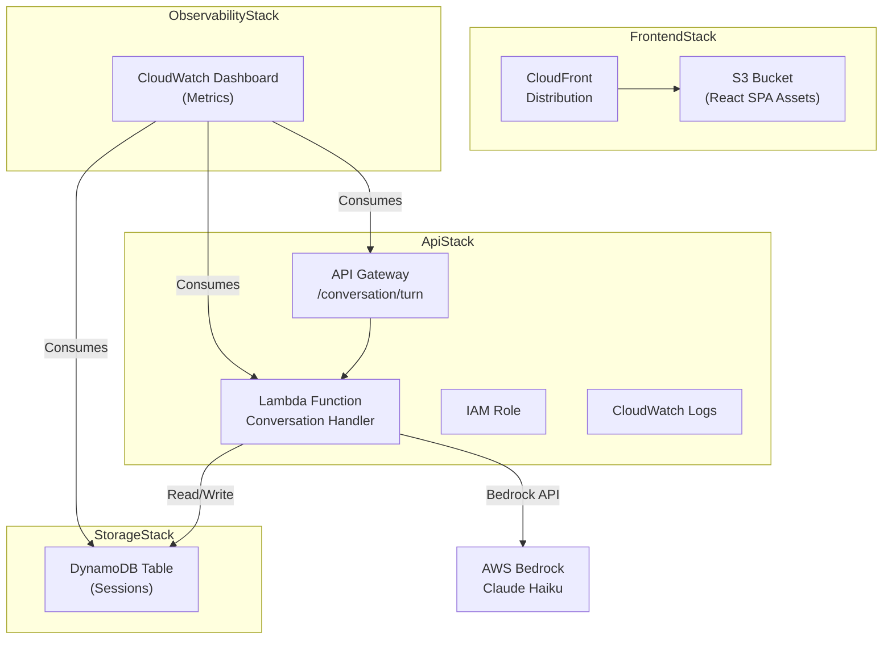

# Infrastructure Guide

This guide documents the AWS infrastructure provisioned for Career Compass using AWS CDK (TypeScript). The infrastructure is organized into four independent stacks, each managing specific service components.

## Table of Contents

- [Overview](#overview)
- [Stack Architecture](#stack-architecture)
- [Storage Stack](#storage-stack)
- [API Stack](#api-stack)
- [Frontend Stack](#frontend-stack)
- [Observability Stack](#observability-stack)
- [Deployment](#deployment)
- [Cross-Stack References](#cross-stack-references)
- [Resource Tagging](#resource-tagging)
- [Cost Optimization](#cost-optimization)

---

## Overview

Career Compass deploys to AWS as a serverless application with four logical, independently deployable stacks:

| Stack Name             | Purpose                      | Key Resources                      | Depends On             |
| ---------------------- | ---------------------------- | ---------------------------------- | ---------------------- |
| **StorageStack**       | Session state persistence    | DynamoDB table with TTL            | None                   |
| **ApiStack**           | REST API and Lambda backend  | API Gateway, Lambda, IAM roles     | StorageStack           |
| **FrontendStack**      | Static asset hosting via CDN | S3 bucket, CloudFront distribution | None                   |
| **ObservabilityStack** | Monitoring and observability | CloudWatch dashboard, alarms       | StorageStack, ApiStack |

**Deployment Order:**

1. StorageStack (no dependencies)
2. ApiStack (requires StorageStack)
3. FrontendStack (no dependencies; can deploy in parallel with steps 1-2)
4. ObservabilityStack (requires all previous stacks)

---

## Stack Architecture



---

## Storage Stack

**File:** `infra/src/stacks/storage-stack.ts`

### Purpose

Manages session state persistence for conversation history and metadata. The DynamoDB table is the single source of truth for all active and expired sessions.

### Resources

#### DynamoDB Table: `SessionTable`

| Property                   | Value                         | Rationale                                     |
| -------------------------- | ----------------------------- | --------------------------------------------- |
| **Table Name**             | Generated by CDK (auto-named) | Avoid naming collisions; exported to ApiStack |
| **Partition Key**          | `sessionId` (string)          | Unique session identifier                     |
| **Sort Key**               | None                          | Single access pattern: sessionId lookup       |
| **Billing Mode**           | PAY_PER_REQUEST (on-demand)   | Cost-efficient for variable traffic           |
| **TTL Attribute**          | `ttl` (epoch seconds)         | Auto-expire sessions after 24 hours           |
| **Encryption**             | AWS-managed (default)         | Data at rest encryption                       |
| **Point-in-Time Recovery** | Disabled                      | Portfolio project; disabled for cost          |
| **Removal Policy**         | DESTROY                       | Clean up data when stack is deleted           |
| **Versioning**             | Not applicable                | DynamoDB does not support versioning          |

### Session State Schema

Session items stored in DynamoDB follow this structure:

```typescript
interface SessionState {
  sessionId: string; // Partition key
  phase: 'discovery' | 'goal_elicitation' | 'synthesis';
  turnCount: number; // Conversation turn count (0-10)
  history: BedrockMessage[]; // Full conversation history
  createdAt: number; // Epoch milliseconds
  ttl: number; // Epoch seconds for 24-hour expiry
}

interface BedrockMessage {
  role: 'user' | 'assistant';
  content: string;
}
```

### Access Patterns

1. **GetItem**: Retrieve session by `sessionId` (primary access pattern)
2. **PutItem**: Create new session or update existing session with new history
3. **DeleteItem**: Manual deletion (automatic via TTL for expired sessions)

### Cost Considerations

- **On-demand pricing**: $1.25 per million read units + $6.25 per million write units
- **Typical session**: ~2-6 read/write operations per conversation turn
- **TTL cleanup**: Automatic; no extra cost for deletion
- **24-hour retention**: ~86,400 seconds; adjust `ttl` calculation for different retention windows

---

## API Stack

**File:** `infra/src/stacks/api-stack.ts`

### Purpose

Exposes a REST API endpoint for conversation turns and manages Lambda execution, permissions, and observability.

### Resources

#### API Gateway: `ConversationApi`

| Property           | Value                                          | Rationale                                     |
| ------------------ | ---------------------------------------------- | --------------------------------------------- |
| **API Name**       | `CareerCompassApi`                             | Human-readable identifier                     |
| **Type**           | REST API                                       | Simple request/response; synchronous calls    |
| **Stage**          | `dev`                                          | Single stage for portfolio project            |
| **Endpoint**       | `POST /conversation/turn`                      | Route for conversation turns                  |
| **CORS**           | `*` (allow all origins)                        | Development; restrict to domain in production |
| **Logging**        | INFO level; request body disabled              | Balance observability and privacy             |
| **Tracing**        | Enabled (X-Ray)                                | Performance and error diagnostics             |
| **Authentication** | None (API Key/auth recommended for production) | Portfolio project; open access                |

#### Lambda Function: `ConversationFunction`

| Property              | Value                                   | Rationale                                   |
| --------------------- | --------------------------------------- | ------------------------------------------- |
| **Function Name**     | `CareerCompassConversationFunction`     | Human-readable identifier                   |
| **Runtime**           | Node.js 24.x                            | Latest stable Node.js; TypeScript support   |
| **Handler**           | `conversation-handler.ts` (via esbuild) | TypeScript source; compiled at deployment   |
| **Memory**            | 512 MB                                  | Sufficient for Bedrock calls + JSON parsing |
| **Timeout**           | 30 seconds                              | API Gateway max timeout is 29 seconds       |
| **Ephemeral Storage** | Default 512 MB                          | No local storage requirements               |
| **Logging Format**    | JSON                                    | Structured logs for CloudWatch Insights     |
| **Log Retention**     | 7 days                                  | Portfolio project; adjust for production    |
| **Tracing**           | X-Ray ACTIVE                            | Distributed tracing for debugging           |
| **Bundling**          | esbuild with minification               | Smaller bundle size; faster cold starts     |

#### Lambda Environment Variables

Injected by CDK at deployment:

| Variable                       | Example Value                                 | Source                                  |
| ------------------------------ | --------------------------------------------- | --------------------------------------- |
| `SESSION_TABLE_NAME`           | `CareerCompassStorageStack-SessionTable...`   | From StorageStack                       |
| `BEDROCK_REGION`               | `us-east-1`                                   | Hardcoded (or cdk.json)                 |
| `BEDROCK_MODEL_ID`             | `us.anthropic.claude-haiku-4-5-20251001-v1:0` | Bedrock inference profile               |
| `BEDROCK_TEMPERATURE`          | `0.7`                                         | Model temperature parameter             |
| `BEDROCK_MAX_TOKENS_DEFAULT`   | `1024`                                        | Max tokens for standard responses       |
| `BEDROCK_MAX_TOKENS_SYNTHESIS` | `3072`                                        | Max tokens for recommendation synthesis |
| `CONVERSATION_MAX_TURNS`       | `10`                                          | Phase state machine max turns           |

#### IAM Permissions

**DynamoDB Access:**

- `dynamodb:GetItem` — Retrieve session by sessionId
- `dynamodb:PutItem` — Create and update sessions

Scoped to: `arn:aws:dynamodb:<region>:<account>:table/<SessionTableName>`

**Bedrock Access:**

- `bedrock:InvokeModel` — Call the Claude Haiku inference profile

Scoped to:

- `arn:aws:bedrock:us-east-1:<account>:inference-profile/us.anthropic.claude-haiku-4-5-20251001-v1:0`
- `arn:aws:bedrock:us-east-1::foundation-model/anthropic.claude-haiku-4-5-20251001-v1:0`

**CloudWatch Logs:**

- Automatic via Lambda execution role; grants `logs:CreateLogGroup`, `logs:CreateLogStream`, `logs:PutLogEvents`

**X-Ray:**

- Automatic via Lambda execution role; grants X-Ray write permissions

### API Endpoint: `POST /conversation/turn`

**Request:**

```json
{
  "sessionId": "optional-session-id-string",
  "userMessage": "string (1-5000 characters, required)"
}
```

**Response (Success - 201 on first turn, 200 on subsequent):**

```json
{
  "type": "conversational" | "synthesis",
  "sessionId": "session-id-string",
  "assistantMessage": "string",
  "phase": "discovery" | "goal_elicitation" | "synthesis",
  "turnCount": number,
  "synthesisReady": boolean
}
```

**Response (Synthesis - includes recommendation artifact):**

```json
{
  "type": "synthesis",
  "sessionId": "session-id-string",
  "phase": "synthesis",
  "turnCount": number,
  "recommendation": {
    "profileSummary": "string",
    "skillGaps": [ { "name": "string", "severity": "low|medium|high", "rationale": "string" } ],
    "recommendations": [ { "area": "string", "rationale": "string", "resourceCategories": ["string"], "estimatedEffort": "minimal|light|moderate|substantial|intensive", "estimatedTimeline": "string" } ]
  }
}
```

---

## Frontend Stack

**File:** `infra/src/stacks/frontend-stack.ts`

### Purpose

Hosts the React SPA frontend on S3 with CloudFront CDN for global distribution and SPA-friendly error handling.

### Resources

#### S3 Bucket: `FrontendBucket`

| Property                | Value                                  | Rationale                              |
| ----------------------- | -------------------------------------- | -------------------------------------- |
| **Bucket Name**         | `career-compass-frontend-<account-id>` | Globally unique; includes account ID   |
| **Block Public Access** | All blocked                            | Private bucket; CloudFront only access |
| **Encryption**          | S3-managed (AES-256)                   | Data at rest encryption                |
| **Versioning**          | Enabled                                | Easy rollback on deployments           |
| **Removal Policy**      | DESTROY + AutoDeleteObjects            | Clean up on stack deletion             |

#### CloudFront Distribution: `FrontendDistribution`

| Property                  | Value                                     | Rationale                                  |
| ------------------------- | ----------------------------------------- | ------------------------------------------ |
| **Origin**                | S3 bucket via Origin Access Control (OAC) | Secure access; no public bucket policy     |
| **Default Root Object**   | `index.html`                              | SPA entry point                            |
| **Price Class**           | PRICE_CLASS_100                           | Cost-optimized; excludes expensive regions |
| **Viewer Protocol**       | REDIRECT_TO_HTTPS                         | Secure HTTPS only                          |
| **Cache Policy**          | CACHING_OPTIMIZED                         | Aggressive caching for performance         |
| **Compression**           | Enabled (Brotli, Gzip)                    | Reduce transfer size                       |
| **Custom Error Handling** | 403/404 → 200 + index.html (SPA routing)  | Client-side routing support                |

#### SPA Routing Configuration

CloudFront intercepts 403 (Access Denied) and 404 (Not Found) responses from S3 and:

1. Serves `index.html` from the bucket
2. Returns HTTP 200 (not the original error code)
3. Disables caching of error responses (`TTL: 0`)

This enables React Router and similar client-side routers to handle navigation without server-side routing configuration.

**Example Flow:**

```
User navigates to: https://example.com/conversation/abc123
↓
CloudFront checks cache → Miss
↓
CloudFront requests /conversation/abc123 from S3
↓
S3 returns 404 (object not found)
↓
CloudFront custom error rule intercepts 404
↓
CloudFront serves /index.html with HTTP 200
↓
React app loads and React Router handles the route
```

#### Deployment: `BucketDeployment`

| Property               | Value                                 | Rationale                                  |
| ---------------------- | ------------------------------------- | ------------------------------------------ |
| **Source**             | `packages/web/dist` (built React app) | Output from `npm run build` in web package |
| **Destination**        | FrontendBucket                        | S3 bucket for static assets                |
| **Cache Invalidation** | `/*` (all files)                      | Ensure users get latest assets on redeploy |
| **Retain on Delete**   | false                                 | Clean up S3 objects when stack is deleted  |

### Outputs

| Output                            | Value                              | Used By            |
| --------------------------------- | ---------------------------------- | ------------------ |
| `CloudFrontDistributionUrlOutput` | `https://<distribution-domain>`    | Team/documentation |
| `CloudFrontDomainNameOutput`      | `<distribution-domain>` (no https) | Internal reference |

---

## Observability Stack

**File:** `infra/src/stacks/observability-stack.ts`

### Purpose

Provides comprehensive observability across Lambda, API Gateway, and DynamoDB via CloudWatch dashboards and logs.

### Resources

#### CloudWatch Dashboard: `career-compass`

**Dashboard Layout:**

The dashboard organizes metrics into four widget groups:

##### 1. API Health Metrics

| Metric               | Statistic | Period | Dimension                | Use Case                        |
| -------------------- | --------- | ------ | ------------------------ | ------------------------------- |
| API Gateway Count    | Sum       | 1 min  | ApiName=CareerCompassApi | Total request volume            |
| API Gateway 4XXError | Sum       | 1 min  | ApiName=CareerCompassApi | Client errors (validation, etc) |
| API Gateway 5XXError | Sum       | 1 min  | ApiName=CareerCompassApi | Server errors (Lambda crashes)  |

##### 2. Lambda Metrics

| Metric             | Statistic | Period | Dimension                     | Use Case                        |
| ------------------ | --------- | ------ | ----------------------------- | ------------------------------- |
| Lambda Invocations | Sum       | 1 min  | FunctionName=CareerCompass... | Successful + failed invocations |
| Lambda Errors      | Sum       | 1 min  | FunctionName=CareerCompass... | Function exceptions             |
| Lambda Duration    | Average   | 1 min  | FunctionName=CareerCompass... | Avg response latency (p50-like) |
| Lambda Throttles   | Sum       | 1 min  | FunctionName=CareerCompass... | Concurrent execution limits hit |

##### 3. DynamoDB Storage Metrics

| Metric                     | Statistic | Period | Dimension              | Use Case                               |
| -------------------------- | --------- | ------ | ---------------------- | -------------------------------------- |
| ConsumedReadCapacityUnits  | Sum       | 1 min  | TableName=SessionTable | Read operations for capacity planning  |
| ConsumedWriteCapacityUnits | Sum       | 1 min  | TableName=SessionTable | Write operations for capacity planning |
| UserErrors                 | Sum       | 1 min  | TableName=SessionTable | Validation/item size errors            |
| SystemErrors               | Sum       | 1 min  | TableName=SessionTable | Temporary service errors               |

##### 4. Cost Indicators Widget

Metrics that correlate with AWS billing:

- Lambda Invocations (each invocation has a cost)
- API Gateway Requests (per million requests)
- DynamoDB Capacity Units (on-demand pricing)

### CloudWatch Logs

#### Log Groups

| Log Group                                          | Source               | Retention   | Removal Policy |
| -------------------------------------------------- | -------------------- | ----------- | -------------- |
| `/aws/lambda/career-compass-conversation-function` | Lambda               | 7 days      | DESTROY        |
| CloudWatch Logs Insights (default)                 | API Gateway, Bedrock | AWS-managed | AWS-managed    |

#### Log Insights Queries

**Example: Find Lambda errors in last hour**

```
fields @timestamp, @message, sessionId, phase
| filter @message like /ERROR/
| stats count() by phase
```

**Example: Average Lambda duration by phase**

```
fields @duration, sessionId, phase
| filter phase in ["discovery", "goal_elicitation", "synthesis"]
| stats avg(@duration) by phase
```

**Example: Bedrock API call count**

```
fields @timestamp, bedrockInvocation
| filter ispresent(bedrockInvocation)
| stats count() as totalInvocations
```

### Alarms (Recommended Future)

Consider setting up SNS alarms for:

| Alarm Name                | Metric          | Threshold        | Action                |
| ------------------------- | --------------- | ---------------- | --------------------- |
| Lambda Error Rate High    | Lambda Errors   | >5 in 5 minutes  | SNS → On-call team    |
| Lambda Duration High      | Lambda Duration | >5 seconds (p99) | SNS → Investigation   |
| DynamoDB Throttling       | SystemErrors    | >0 in 1 minute   | SNS → Capacity review |
| API Gateway 5XX Rate High | 5XXError        | >10 in 5 minutes | SNS → Investigation   |

---

## Deployment

### Prerequisites

```bash
# Install AWS CDK CLI
npm install -g aws-cdk

# Configure AWS credentials
export AWS_PROFILE=your-profile
# OR use environment variables: AWS_ACCESS_KEY_ID, AWS_SECRET_ACCESS_KEY

# Navigate to infrastructure directory
cd infra
npm install
npm run build
```

### Local Deployment

**Synthesize CDK (generate CloudFormation template):**

```bash
npm run cdk:synth
```

This validates the CDK code and outputs a `cdk.out/` directory with CloudFormation JSON.

**Deploy all stacks:**

```bash
npm run cdk:deploy
```

The CDK will:

1. Display a summary of resources to be created
2. Ask for confirmation (unless `--require-approval=never` is set)
3. Deploy StorageStack → ApiStack → FrontendStack → ObservabilityStack in dependency order
4. Output stack outputs (API endpoint, CloudFront URL, etc.) after successful deployment

**Deploy specific stacks:**

```bash
# Deploy only StorageStack and ApiStack
npm run cdk:deploy -- StorageStack ApiStack
```

### Destroy Infrastructure

**Tear down all stacks:**

```bash
npm run cdk:destroy
```

This will:

1. Delete all stacks in reverse deployment order
2. Destroy S3 bucket and DynamoDB table (due to `removalPolicy: DESTROY`)
3. Remove CloudFormation stacks from AWS

**Destroy specific stacks:**

```bash
npm run cdk:destroy -- CareerCompassFrontendStack
```

**Important:** Use `removalPolicy: RETAIN` if you want to preserve data when tearing down stacks.

---

## Cross-Stack References

### Stack Exports

CDK exports stack outputs for use by dependent stacks:

| Export Name                               | Exported By   | Consumed By         | Value                |
| ----------------------------------------- | ------------- | ------------------- | -------------------- |
| `CareerCompass-SessionTableName`          | StorageStack  | ApiStack            | DynamoDB table name  |
| `CareerCompass-ConversationApiUrl`        | ApiStack      | FrontendStack (env) | API Gateway endpoint |
| `CareerCompass-CloudFrontDistributionUrl` | FrontendStack | Team/documentation  | CloudFront URL       |

### Dependency Order

CDK enforces dependencies:

```
FrontendStack (independent)
    ↓
StorageStack
    ↓
ApiStack (depends on StorageStack)
    ↓
ObservabilityStack (depends on all above)
```

**Deployment Order:**

1. FrontendStack and StorageStack can deploy in parallel
2. ApiStack deploys after StorageStack
3. ObservabilityStack deploys after ApiStack

---

## Resource Tagging

All stacks apply standard tags to resources for cost allocation and filtering:

```typescript
const tags = {
  App: 'CareerCompass', // Application name
  Env: 'dev', // Environment (dev, staging, prod)
  OU: 'leanstacks', // Organizational unit
  Owner: 'Matthew Warman', // Resource owner
};
```

**Filter by tag in AWS Console:**

```
Tag key: App | Tag value: CareerCompass
```

---

## Cost Optimization

### Current Cost Drivers

| Service     | Cost Model             | Monthly Estimate (low traffic) | Notes                               |
| ----------- | ---------------------- | ------------------------------ | ----------------------------------- |
| Lambda      | $0.20 per million reqs | <$1                            | 10 requests × 0.5 seconds each      |
| DynamoDB    | On-demand ($/1M units) | <$1                            | TTL expires sessions after 24h      |
| API Gateway | $3.50 per million reqs | <$1                            | 10 requests per day                 |
| CloudFront  | $0.085 per GB egress   | <$1                            | ~12 GB/month for typical traffic    |
| **Total**   |                        | **<$5/month**                  | Portfolio project costs are minimal |

### Cost Optimization Strategies

1. **Lambda**: Currently 512 MB; reduce to 256 MB if performance allows (saves ~30% on compute)
2. **Log Retention**: Currently 7 days; reduce to 3 days to save CloudWatch Logs costs
3. **CloudFront**: Currently PRICE_CLASS_100; consider PRICE_CLASS_ALL for wider geographic reach
4. **DynamoDB**: On-demand pricing ideal for variable traffic; monitor and switch to provisioned if traffic becomes predictable
5. **Point-in-Time Recovery**: Disabled to save ~$0.20/day; enable in production if backup requirement exists

### Budget Alerts

Set up AWS Budgets to track costs:

1. Go to AWS Budgets console
2. Create a budget for CareerCompass resources
3. Set monthly budget to $10 (conservative for this project)
4. Configure SNS alert at 80% and 100% of budget

---

## Related Documentation

- [DevOps Guide](./DEVOPS_GUIDE.md) — CI/CD workflows and deployment procedures
- [Configuration Guide](./CONFIGURATION_GUIDE.md) — Environment variables and application config
- [Implementation Plan](./IMPLEMENTATION_PLAN.md) — Project roadmap and milestones
- [AWS CDK Documentation](https://docs.aws.amazon.com/cdk/v2/)
