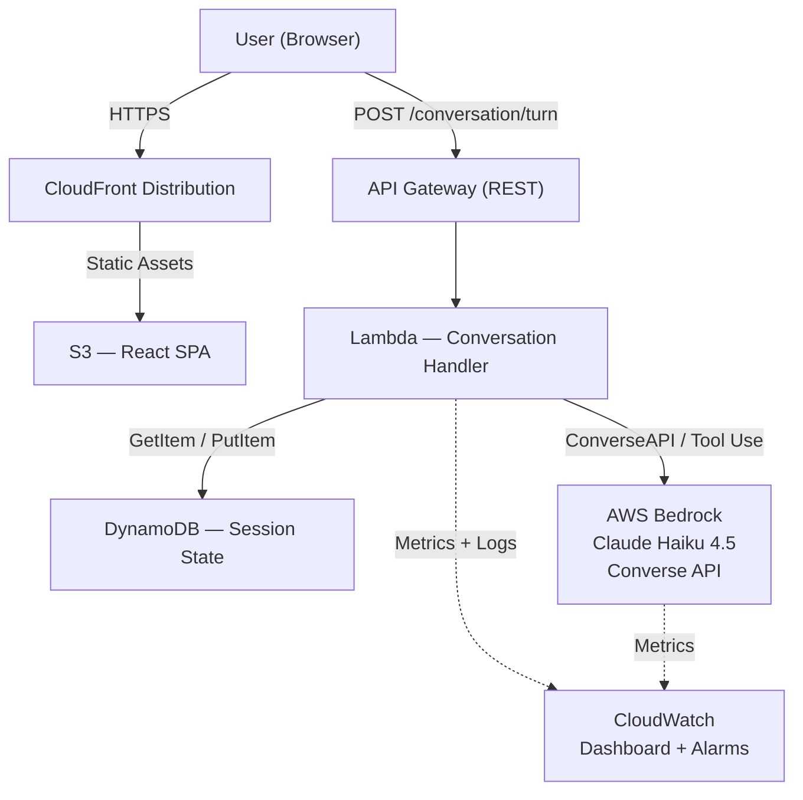
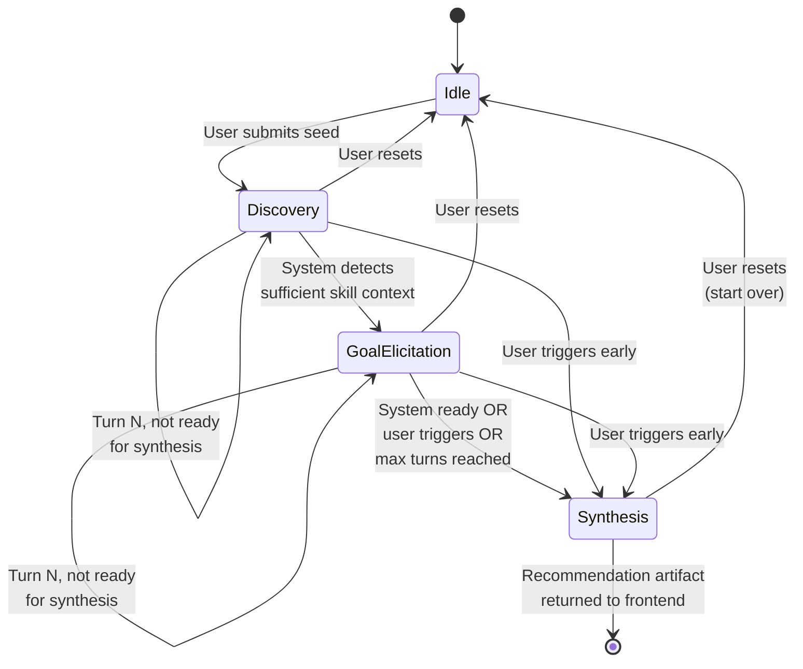

# Project Overview: career-compass

**Version:** Draft 2  
**Date:** 2026-05-05  
**Project Type:** Portfolio  
**Status:** In Elaboration

---

## Executive Summary

`career-compass` is a conversational AI application that guides professionals
through a structured but adaptive multi-turn dialogue to assess their current
skills, surface career goals, identify skill gaps, and produce a prioritized
upskilling recommendation. The system demonstrates production-grade
conversational AI design: progressive context accumulation across turns,
phase-aware prompt architecture, hybrid conversation control, and structured
artifact generation via Bedrock native tool use — without relying on RAG,
agentic loops, or managed chat UIs. It is the second entry in a portfolio
suite of AWS Bedrock-powered applications, complementing `resume-lens`.

---

## Goals

- **Primary Goal:** Demonstrate mastery of conversational AI integration
  patterns — multi-turn state management, phase-aware prompt architecture,
  hybrid conversation control, context accumulation, and structured output
  generation via Bedrock tool use — using AWS Bedrock (Claude Haiku 4.5) as
  the inference layer.
- **Secondary Goals:**
  - Produce a portfolio artifact immediately recognizable and relevant to
    enterprise IT clients and technical evaluators
  - Establish `career-compass` as a thematic companion to `resume-lens`,
    forming a coherent AI-powered career tooling portfolio suite
  - Maintain cost efficiency appropriate for a personally funded portfolio
    project throughout development and demonstration

---

## Scope

### In Scope

- Seed-initiated conversation: user provides brief context to cold-start
  the dialogue
- Multi-turn conversational session management: full message history
  passed to Bedrock Converse API on each turn
- Phase-aware system prompt architecture across three conversation phases:
  Discovery, Goal Elicitation, and Synthesis
- Hybrid conversation control: system-guided questioning with adaptive
  handling of user-volunteered information at any turn
- System self-evaluation after each turn to assess synthesis readiness
- User-initiated synthesis trigger ("I'm ready for recommendations")
- Maximum turn count enforcement (10 turns) with automatic synthesis trigger
- Conversation restart / reset within an active session
- Fresh conversation on every visit (no cross-session persistence)
- Terminal synthesis via Bedrock forced tool use (`generate_recommendation`
  tool) producing validated structured JSON output
- Zod schema validation of synthesis output on the backend before
  returning to frontend
- Structured recommendation artifact displayed in the frontend UI:
  - Identified skill gaps (prioritized)
  - Recommended learning areas with goal-tied rationale
  - Suggested certification / resource categories
  - Estimated effort and timeline per recommendation
  - Inferred profile summary built during conversation
- Minimal Vite + React frontend sufficient to drive the conversation and
  display the recommendation artifact
- REST API (API Gateway + Lambda) for conversation turn management
- DynamoDB for session state persistence with TTL-based expiry
- AWS CDK (TypeScript) IaC across four stacks
- GitHub Actions CI/CD: CI workflow, Deploy workflow, Teardown workflow
- CloudWatch dashboard: service utilization and cost-bearing metrics
- Monorepo structure with npm workspaces

### Out of Scope

- RAG / knowledge base integration (dedicated future portfolio project)
- Agentic / autonomous tool-use patterns (dedicated future portfolio project)
- User authentication or multi-user account management
- Production-grade frontend (accessibility, mobile optimization, polish)
- Cross-session conversation persistence ("resume last session")
- Live links to learning resources or external platform integrations
- Progressive summarization context management (documented as V2 enhancement)
- Streaming token output / WebSocket API

---

## Target Audience

| Audience                                             | Signal Being Demonstrated                                                                                                                                                                  |
| ---------------------------------------------------- | ------------------------------------------------------------------------------------------------------------------------------------------------------------------------------------------ |
| Enterprise IT clients                                | Ability to design goal-directed conversational AI workflows that extract structured insight from natural dialogue — directly applicable to L&D, onboarding, intake, and advisory use cases |
| Technical evaluators (architects, engineering leads) | Phase-aware prompt engineering, Bedrock Converse API + tool use patterns, clean AWS-native serverless architecture, monorepo discipline, IaC maturity                                      |

---

## Technology Stack

| Layer          | Technology / Service                                             | Rationale                                                                                                      |
| -------------- | ---------------------------------------------------------------- | -------------------------------------------------------------------------------------------------------------- |
| Frontend       | Vite + React, TailwindCSS, shadcn/ui, TanStack Query, Axios, Zod | Minimal but modern; consistent with current TypeScript ecosystem standards                                     |
| Backend        | AWS Lambda (Node.js / TypeScript), API Gateway (REST)            | Serverless, pay-per-invocation, cost-optimized                                                                 |
| AI Inference   | AWS Bedrock — Converse API + Tool Use, Claude Haiku 4.5          | Model-agnostic Converse API for conversation turns; forced tool use for synthesis; Haiku for cost optimization |
| Session State  | DynamoDB (on-demand capacity, TTL expiry)                        | Serverless, low-cost, fits session lifetime pattern                                                            |
| IaC            | AWS CDK (TypeScript)                                             | Consistent with application stack; four-stack decomposition                                                    |
| CI/CD          | GitHub Actions                                                   | CI, Deploy, and Teardown workflows                                                                             |
| Observability  | CloudWatch Dashboard + Alarms                                    | Service utilization and cost-bearing metric visibility                                                         |
| Monorepo       | npm workspaces                                                   | Single repository for portfolio reviewers; shared Zod schemas across frontend and backend                      |
| Source Control | GitHub + GitHub Issues + GitHub Milestones                       | Issues and milestones aligned to Implementation Plan                                                           |

---

## Architecture Overview

The system is a serverless REST API backend fronted by a minimal React SPA.
Each conversation turn is a discrete POST request carrying the user's message.
The backend retrieves session state from DynamoDB, appends the new turn,
selects the appropriate phase-aware system prompt, and invokes Bedrock via
the Converse API. For synthesis turns, the backend switches to forced tool
use to produce schema-validated JSON. The frontend displays conversational
turns in a chat interface and renders the structured recommendation artifact
when synthesis is complete.

### Conversation State Machine

---

## Key Design Decisions

### Decision: Bedrock Converse API vs. InvokeModelCommand

| Option             | Pros                                                                                             | Cons                                                                              |
| ------------------ | ------------------------------------------------------------------------------------------------ | --------------------------------------------------------------------------------- |
| Converse API       | Model-agnostic; native multi-turn message history handling; correct abstraction for conversation | Slightly less raw prompt control                                                  |
| InvokeModelCommand | Full prompt control; used in `resume-lens`                                                       | Model-specific payload; manual history assembly; wrong abstraction for multi-turn |

**Decision:** Converse API
**Rationale:** Correct tool for multi-turn conversation. Demonstrates breadth
beyond `resume-lens` and awareness of the right Bedrock abstraction per use case.

---

### Decision: Structured Output Enforcement at Synthesis

| Option                                              | Pros                                                                                | Cons                                                           |
| --------------------------------------------------- | ----------------------------------------------------------------------------------- | -------------------------------------------------------------- |
| Prompt-only JSON enforcement                        | Simple                                                                              | Reliably produces Markdown-wrapped JSON, not raw JSON; brittle |
| Bedrock forced tool use (`toolChoice`)              | Native schema enforcement; returns structured `toolUse` block; no Markdown wrapping | Synthesis-only; awkward if applied to conversational turns     |
| Bedrock native structured output (separate feature) | Clean                                                                               | Limited Converse API compatibility for multi-turn flows        |

**Decision:** Forced tool use at synthesis turn only + Zod validation on backend
**Rationale:** Conversational turns use standard Converse API for natural
language responses. Synthesis turn forces a `generate_recommendation` tool
call, constraining the model to return a structured `toolUse` block matching
the recommendation schema. Zod validates the tool input on the backend before
the payload reaches the frontend. This is the architecturally correct pattern
and a stronger portfolio signal than prompt coaxing.

---

### Decision: Context Management Strategy

| Option                    | Pros                                                  | Cons                                                                |
| ------------------------- | ----------------------------------------------------- | ------------------------------------------------------------------- |
| Full history              | Simple; accurate; preserves all context for synthesis | Token cost grows linearly; acceptable at 10-turn ceiling with Haiku |
| Sliding window            | Cheaper                                               | Risks losing early discovery context at synthesis                   |
| Progressive summarization | Cost-controlled; semantically preserves context       | Implementation complexity; better suited to longer sessions         |

**Decision:** Full history for V1
**Rationale:** At a 10-turn ceiling with Haiku token pricing, full history
is cost-acceptable and keeps the implementation clean. Progressive
summarization is documented as a V2 enhancement.

---

### Decision: Phase-Aware System Prompt Architecture

| Option                                 | Pros                                                                       | Cons                                                       |
| -------------------------------------- | -------------------------------------------------------------------------- | ---------------------------------------------------------- |
| Single static system prompt            | Simple                                                                     | Prompt complexity grows unwieldy; harder to tune per phase |
| Phase-aware prompt (swapped per phase) | Clean separation; independently tunable per phase; better portfolio signal | Slightly more backend logic to manage phase transitions    |

**Decision:** Phase-aware system prompt
**Rationale:** Three discrete prompts — Discovery, Goal Elicitation, Synthesis
— map to the conversation arc. The backend selects the active prompt based
on session phase stored in DynamoDB. Cleaner, more maintainable, and
demonstrates prompt engineering discipline.

---

### Decision: CDK Stack Decomposition

| Stack                | Contents                                                      |
| -------------------- | ------------------------------------------------------------- |
| `StorageStack`       | DynamoDB table, TTL configuration                             |
| `ApiStack`           | Lambda functions, API Gateway, IAM roles, Bedrock permissions |
| `FrontendStack`      | S3 bucket, CloudFront distribution, bucket deployment         |
| `ObservabilityStack` | CloudWatch dashboard, alarms, log groups                      |

**Rationale:** Separates concerns by change frequency and deployment
lifecycle. Storage changes independently of API logic; frontend deploys
independently of backend; observability is additive and non-blocking.

---

## Constraints

- **Time:** ~1 month elapsed, 80–100 hours of effort; AI-assisted coding
- **Budget:** Personally funded; serverless pay-per-invocation throughout;
  no always-on compute
- **Team:** Solo
- **Existing Systems:** `resume-lens` establishes Bedrock familiarity and
  portfolio context; `career-compass` is a new, independent project

---

## Risks & Mitigations

| Risk                                                                       | Likelihood | Impact | Mitigation                                                                                   |
| -------------------------------------------------------------------------- | ---------- | ------ | -------------------------------------------------------------------------------------------- |
| Phase transition logic is too rigid, producing unnatural conversation flow | Medium     | High   | Tune phase-aware prompts iteratively; allow hybrid user control to override phase boundaries |
| Synthesis tool use schema drift between Bedrock response and Zod schema    | Low        | Medium | Define Zod schema as the single source of truth; derive Bedrock tool schema from it          |
| Bedrock costs exceed expectations during active development                | Low        | Medium | Enable AWS billing alerts from day one; use Haiku throughout including dev/test              |
| Prompt tuning consumes disproportionate effort                             | Medium     | Medium | Time-box prompt iteration; treat prompt quality as an incremental improvement, not a gate    |
| CDK stack cross-dependencies introduce deployment ordering complexity      | Low        | Low    | Define explicit stack dependencies in CDK app entry point; document deploy order             |

---

## V2 Enhancements (Post V1 Delivery)

- **Progressive summarization:** Replace full history with a compressed
  profile summary block after N turns to control token cost at scale
- **Streaming output:** WebSocket API + Bedrock streaming for token-level
  frontend rendering
- **Cross-session persistence:** Optional "resume last session" capability
  with user identifier

---

## Open Questions

- [x] Target timeframe — resolved: ~1 month, 80–100 hours
- [x] Frontend stack — resolved: Vite + React + Tailwind + shadcn/ui +
      TanStack Query + Axios + Zod
- [x] Bedrock model — resolved: Claude Haiku 4.5
- [x] Context management — resolved: full history, V1
- [x] IaC tooling — resolved: AWS CDK, TypeScript, four stacks
- [x] Observability — resolved: CloudWatch dashboard + alarms
- [x] Terminal output — resolved: structured JSON via forced tool use,
      displayed in frontend
- [x] API design — resolved: REST
- [x] CDK stack decomposition — resolved: four stacks, no network stack
- [x] Project name — resolved: career-compass

---

## Revision History

| Version | Date       | Changes                                                                                                                                         |
| ------- | ---------- | ----------------------------------------------------------------------------------------------------------------------------------------------- |
| Draft 1 | 2026-05-05 | Initial brainstorming draft                                                                                                                     |
| Draft 2 | 2026-05-05 | Full elaboration: technology stack, architecture diagrams, conversation state machine, all key design decisions resolved, open questions closed |
